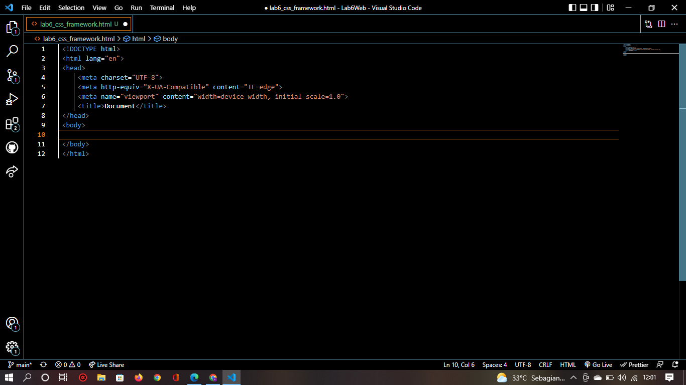
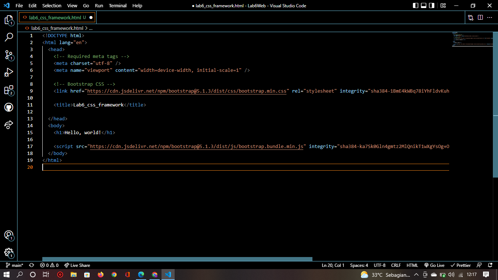
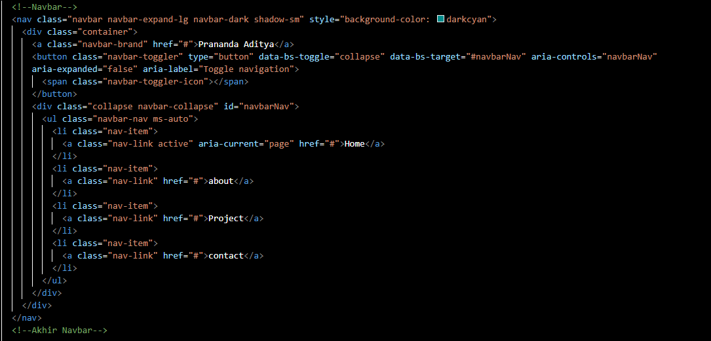
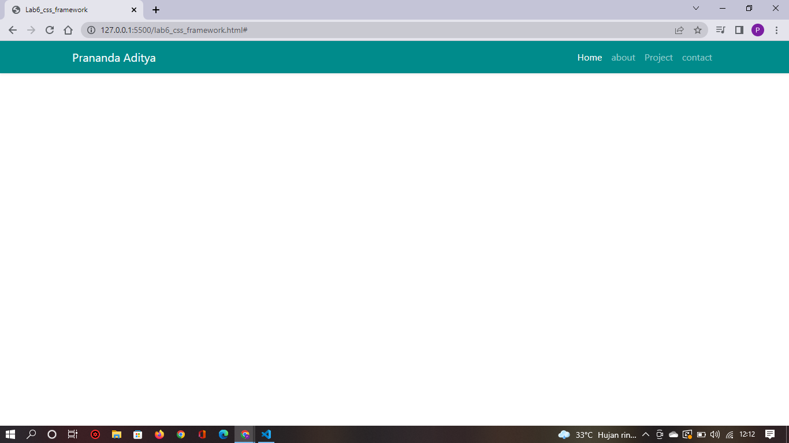
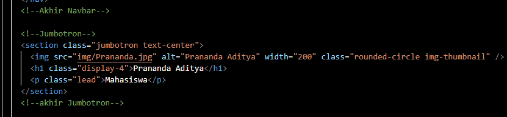
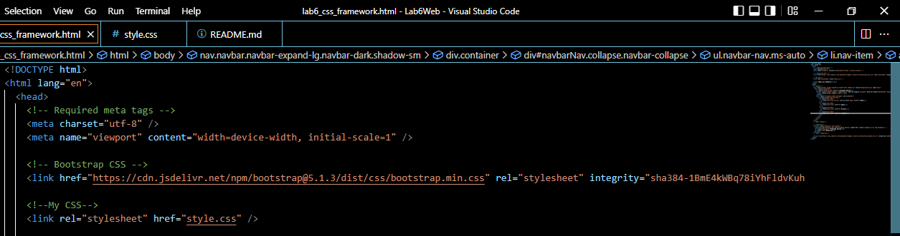
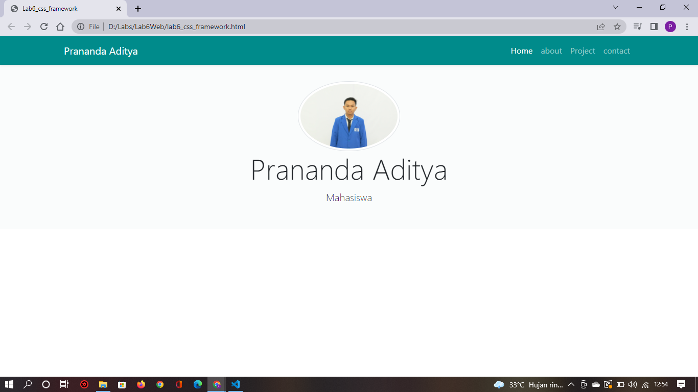

# Lab6Web

# Langkah-langkah Praktikum 6

## 1. Buat file baru dengan nama lab6_css_framework HTML.

## 2. Buatlah layout web sederhana menggunakan css framework (Twitter Bootsrtap)

### 1. Quick start

 buka web https://getbootstrap.com Disini saya memakai Bootstrap 5. seperti berikut.

 lalu buka pada browser untuk melihat hasilnya.

### 2. Membuat Navbar

 Buat komponen website yang berupa menu. yang biasanya di letakkan pada header website. seperti gambar berikut.

 lalu refresh pada browser untuk melihat hasilnya.

### 3. Jumbotron

 selanjutnya buat jumbotron atau area besar pada boostrap, umumnya digunakan untuk menampilkan sebuah informasi. seperti berikut.

 masukan link css dibawah link boostrap seperti berikut.

 kemudian tambahkan css untuk mengubah tampilan jumbotron seperti kode berikut.

 maka hasilnya akan seperti ini.

