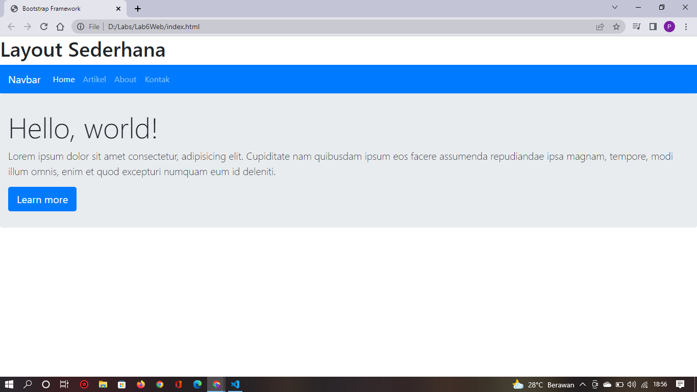

# Layout Sederhana menggunakan Bootstrap Framework

## Langkah-langkah pembuatan layout sederhana menggunakan bootstrap framework

### 1. Membuat dokumen HTML

<br>Seperti Berikut.

```HTML
<!DOCTYPE html>
<html lang="en">
  <head>
    <meta charset="UTF-8" />
    <meta http-equiv="X-UA-Compatible" content="IE=edge" />
    <meta name="viewport" content="width=device-width, initial-scale=1.0" />
    <title>Bootstrap Framework</title>
  </head>
  <body></body>
</html>
```

### 2. Quick Start

<br>Disini saya menggunakan bootstrap 5. bootstrap sendiri merupakan website penyedia open source yang didalam nya terdapat file-file. berikut file yang saya gunakan.

```HTML
<!--Navbar-->
    <nav class="navbar navbar-expand-lg navbar-dark bg-primary">
      <a class="navbar-brand" href="#">Navbar</a>
      <button class="navbar-toggler" type="button" data-toggle="collapse" data-target="#navbarNavAltMarkup" aria-controls="navbarNavAltMarkup" aria-expanded="false" aria-label="Toggle navigation">
        <span class="navbar-toggler-icon"></span>
      </button>
      <div class="collapse navbar-collapse" id="navbarNavAltMarkup">
        <div class="navbar-nav">
          <a class="nav-link active" href="#">Home <span class="sr-only">(current)</span></a>
          <a class="nav-link" href="#">Artikel</a>
          <a class="nav-link" href="#">About</a>
          <a class="nav-link" href="#">Kontak</a>
        </div>
      </div>
    </nav>
    <!--Akhir Navbar-->
```


### 3. Jumbotronp

```HTML
<!--Jumbotron-->
    <div class="jumbotron">
      <h1 class="display-4">Hello, world!</h1>
      <p class="lead">Lorem ipsum dolor sit amet consectetur, adipisicing elit. Cupiditate nam quibusdam ipsum eos facere assumenda repudiandae ipsa magnam, tempore, modi illum omnis, enim et quod excepturi numquam eum id deleniti.</p>
      <a class="btn btn-primary btn-lg" href="#" role="button">Learn more</a>
    </div>
    <!--Akhir Jumbotron-->
```


